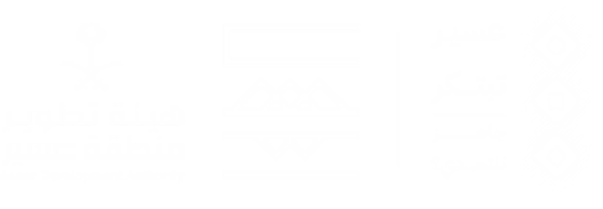
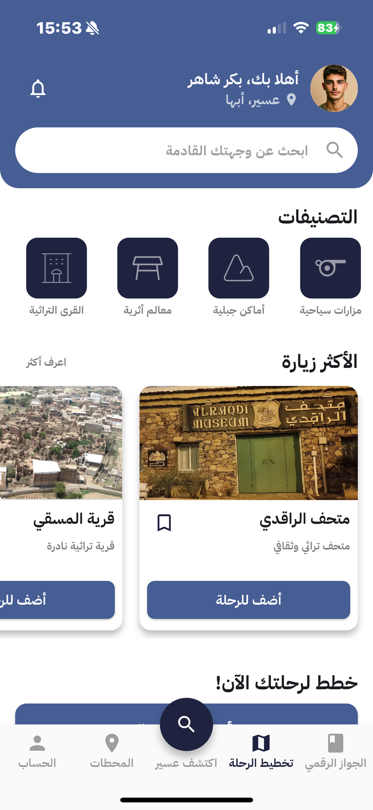
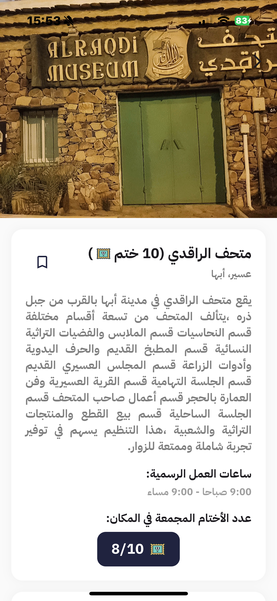
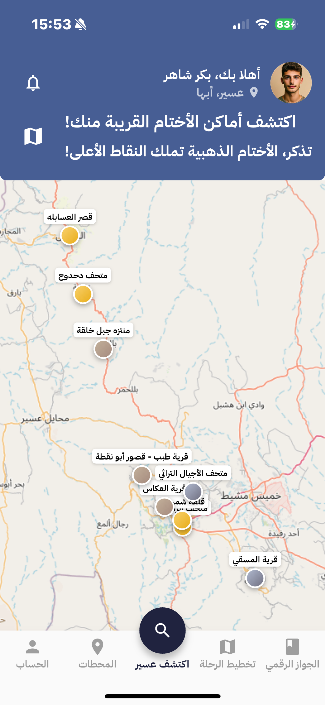
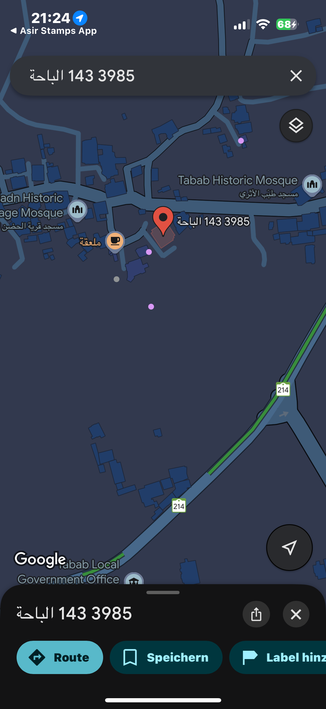
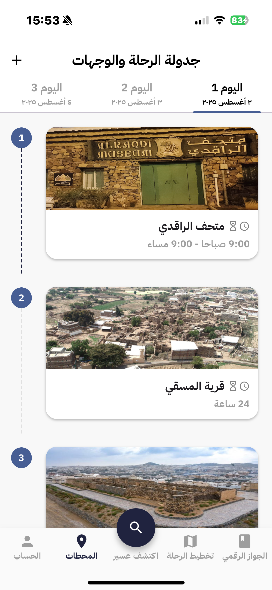

<div dir="rtl">

# 🏔️ ختوم عسير - Asir Stamps

<div align="center">



**تطبيق الجواز الرقمي لاستكشاف منطقة عسير**

_حول رحلتك السياحية إلى مغامرة ممتعة مع نظام الأختام الرقمية_

[](https://flutter.dev)
[](https://firebase.google.com)
[](https://dart.dev)

</div>

## 🌟 نظرة عامة

**ختوم عسير** هو تطبيق مبتكر يحول التجربة السياحية التقليدية إلى مغامرة تفاعلية ممتعة من خلال نظام الأختام الرقمية. تم تطوير التطبيق خصيصاً لهاكاثون عسير لحل مشكلة التجربة السياحية المملة والسطحية.

### 🎯 المشكلة التي نحلها

- التجربة السياحية التقليدية مملة وسطحية
- عدم وجود حافز لاستكشاف الوجهات المخفية
- ضعف الربط بين السياحة والاقتصاد المحلي
- عدم توفر بيانات دقيقة عن أنماط حركة السياح

### 💡 الحل المبتكر

نحول الاستكشاف إلى **لعبة ممتعة (Gamification)** قائمة على:

- جمع الأختام الرقمية من المواقع السياحية
- نظام مكافآت حقيقية تدعم الاقتصاد المحلي
- خريطة تفاعلية لاكتشاف الوجهات القريبة
- جواز رقمي شخصي لتتبع الإنجازات

## 📱 لقطات من التطبيق

<div align="center">

### 🏠 الشاشة الرئيسية - الجواز الرقمي


_جوازك الرقمي الشخصي مع الكود الخاص، عدد الأختام، والترتيب في الصدارة_

---

### 🗺️ تخطيط الرحلة




_تصفح الوجهات، اطلع على التفاصيل، وأضف المواقع لجدولك الزمني_

---

### 🧭 اكتشف عسير - الخريطة التفاعلية




_خريطة تفاعلية تدلك على أقرب الأختام حولك مع مواقع دقيقة_

---

### 📅 المحطات والجدولة



_نظم رحلتك بجدول زمني مرن وقابل للتعديل_

---

### 👤 الملف الشخصي


_تتبع إنجازاتك وحول نقاطك لقسائم خصم فورية_

</div>

## 🎮 المميزات الرئيسية

### 🏆 نظام الأختام المتدرج

- **🥉 أختام برونزية**: للمواقع الأساسية
- **🥈 أختام فضية**: للوجهات المتوسطة
- **🥇 أختام ذهبية**: للمواقع النادرة والمميزة (نقاط أعلى)

### 🗺️ الخريطة التفاعلية

- تصنيف الأختام بالألوان حسب النوع
- روابط مباشرة لخرائط جوجل
- عرض المسافة والاتجاهات

### 📱 الجواز الرقمي

- كود QR شخصي لكل مستخدم
- تتبع مستوى التقدم
- عداد الأختام المجمعة
- ترتيب في لوحة الصدارة

### 🎯 تخطيط الرحلات الذكي

- إضافة المواقع للجدول الزمني
- تنظيم الرحلة على عدة أيام
- معلومات مفصلة عن كل موقع
- ساعات العمل ورسوم الدخول

## 🛠️ التقنيات المستخدمة

### 📱 تطوير التطبيق

- **Flutter**: إطار عمل متعدد المنصات
- **Dart**: لغة البرمجة الأساسية
- **Material Design**: تصميم متوافق مع معايير جوجل

### ☁️ البنية التحتية

- **Firebase**: منصة سحابية شاملة لتخزين البيانات والمزامنة الفورية عبر جميع الأجهزة
- **Firebase Authentication**: نظام مصادقة آمن ومتقدم لإدارة حسابات المستخدمين وتسجيل الدخول
- **Firebase Crashlytics**: كشف تلقائي للأخطاء وتقارير الأعطال لضمان استقرار التطبيق وموثوقيته
- **Firebase Analytics**: رؤى شاملة لسلوك المستخدمين مع مقاييس التفاعل ومعدلات الاحتفاظ وتتبع التحويلات

### 🎨 التصميم والواجهات

- **Custom Fonts**: خط IBM Plex Sans Arabic
- **SVG Icons**: أيقونات متجهة عالية الجودة
- **Gradient Designs**: تدرجات لونية جذابة

## 🏗️ هيكل المشروع

<div dir="ltr">

```
lib/
├── models/           # نماذج البيانات
├── screens/          # شاشات التطبيق
├── services/         # خدمات التطبيق
├── utils/           # الأدوات والثوابت
├── widgets/         # المكونات القابلة لإعادة الاستخدام
└── main.dart        # نقطة البداية
```

</div>

## 🚀 كيفية التشغيل

### المتطلبات الأساسية

- Flutter SDK (3.0+)
- Dart SDK (3.0+)
- Android Studio / VS Code
- Firebase Project

### خطوات التشغيل

1. **استنساخ المشروع**
<div dir="ltr">

```bash
git clone https://github.com/GeylanKalafMohe/Asir-Stamps.git
cd Asir-Stamps
```

</div>

2. **تثبيت التبعيات**

<div dir="ltr">

```bash
flutter pub get
```

</div>

3. **تشغيل التطبيق**

<div dir="ltr">

```bash
flutter run
```

</div>

## 🎯 الوجهات المتاحة

تم إضافة **١٠ وجهات** حالياً، وسيتم إضافة ١٠ وجهات جديدة قريباً. في منطقة عسير:

| الوجهة                   | النوع        | نوع الختم |
| ------------------------ | ------------ | --------- |
| متحف الراقدي             | متحف تراثي   | 🥇 ذهبي   |
| قرية المسقي              | قرية تراثية  | 🥈 فضي    |
| قلعة شمسان               | قلعة تاريخية | 🥇 ذهبي   |
| قرية العكاس              | قرية تراثية  | 🥉 برونزي |
| متحف الأجيال التراثي     | متحف تراثي   | 🥈 فضي    |
| قرية طبب - قصور أبو نقطة | قصور تاريخية | 🥉 برونزي |
| متحف دحدوح               | متحف تراثي   | 🥇 ذهبي   |
| قرية الحوزة              | قرية جبلية   | 🥈 فضي    |
| منتزه جبل خلقة           | منتزه طبيعي  | 🥉 برونزي |
| قصر العسابله             | قصر تاريخي   | 🥇 ذهبي   |

## 🌍 القابلية للتوسع

النموذج مصمم ليكون **قابلاً للتكرار والتعميم** على أي منطقة سياحية:

- ختوم العلا
- ختوم جدة التاريخية
- ختوم الرياض التراثية
- أي منطقة سياحية في المملكة

## 📊 القيمة المضافة

### 🧳 للسائح

- تجربة ممتعة وتفاعلية
- اكتشاف وجهات جديدة ومخفية
- مكافآت وخصومات حقيقية
- ذكريات رقمية مميزة

### 🏪 للمجتمع المحلي

- دعم المنشآت الصغيرة
- توزيع الإقبال السياحي
- خلق حلقة اقتصادية مستدامة
- تخفيف الضغط على المواقع الرئيسية

### 📈 للبيانات والتحليل

- جمع بيانات سلوكية فريدة
- أنماط حركة السياح
- تحسين التجربة السياحية

## 🤝 الشركاء والرعاة

<div align="center">


</div>

## 👥 فريق التطوير

تم تطوير هذا التطبيق بواسطة فريق متخصص في **هاكاثون عسير** لإبتكار حلول تقنية تدعم السياحة المحلية.

---

<div align="center">

**🏔️ عسير، حيث كل قمة تروي حكاية**

_حول رحلتك من جولة عادية إلى تجربة تفاعلية لا تُنسى_

</div>

</div>
